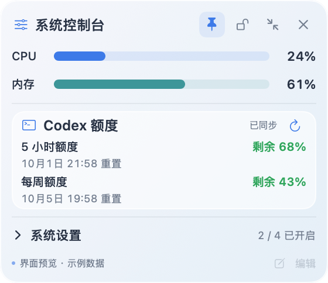
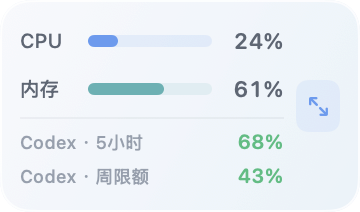

# Mac Float Console

**A small, always-available macOS panel for system health and Codex quota.**

[简体中文](README.zh-CN.md) · English

Mac Float Console lives in the menu bar and opens a movable, pin-able floating panel. It shows system-wide CPU and memory usage alongside the remaining Codex 5-hour and weekly quotas. Collapse the demo system switches or shrink the whole panel when you need more screen space.

Product preview with illustrative values. The running app reads live metrics and the signed-in Codex account.

## What works today

| Area | Behavior | Update |
| --- | --- | --- |
| CPU | System-wide busy time across all logical processors | Every 2 seconds |
| Memory | Active, wired, and physically compressed RAM as a share of installed RAM | Every 2 seconds |
| Codex | Remaining percentage and local reset time for available 5-hour and weekly windows | At launch, every 5 minutes, or manually |
| Floating window | Drag, pin, lock, collapse switches, shrink/expand, hide/reopen from menu bar | Immediate |
| System switches | Prevent sleep, Do Not Disturb, show hidden files, auto-hide Dock | **UI demo only** |

The compact panel stays 180 points wide, includes both Codex percentages, omits reset times, and uses 75% opacity:

The default panel is 280 × 242 points. Expanding the switch section makes it 280 × 366; compact mode is 180 × 106.

## Run locally

Requires macOS 14 or newer and Xcode Command Line Tools with Swift. Build the source on your Mac:

~~~sh
zsh scripts/build-app.sh
open dist/系统控制台.app
~~~

The build creates a locally signed app and a zip in the ignored dist directory. The repository does not contain a prebuilt or notarized release. CPU and memory work without a login. To display live Codex quota, install and sign in to the Codex CLI with a ChatGPT account.

Drag the title area in the normal panel, or drag the CPU, memory, or Codex data area in compact mode. The blue button expands the compact panel. The pin button toggles always-on-top; the lock button prevents dragging in either mode. Closing the panel leaves its menu-bar icon available for reopening or quitting.

## Data and privacy

CPU comes from consecutive macOS processor-time samples, so the first percentage appears after roughly two seconds. Memory uses macOS virtual-memory counters; its definition is close to, but may differ slightly from, Activity Monitor's Memory Used. Whole-number percentages may stay unchanged when utilization is steady.

Codex quota is read through the locally installed Codex CLI app-server, using its read-only rate-limits request. The app does not read or save authentication tokens, create model turns, or consume quota-reset credits. If the CLI is unavailable or signed out, the UI shows an unavailable state; a failed refresh preserves the last successful reading. No analytics, telemetry, or app-level preference storage is implemented.

The four colored switches change only their on-screen state. They do not change macOS settings and reset when the app exits. The Edit shortcut entry is deliberately disabled.

## Project docs and development

- [Product requirements / PRD (English)](docs/PRD.en.md)
- [产品需求文档 / PRD（简体中文）](docs/PRD.zh-CN.md)
- [中文使用说明](README.zh-CN.md)

~~~sh
zsh scripts/check-system-metrics.sh
zsh scripts/check-quota.sh
zsh scripts/export-previews.sh --demo
~~~

The preview command renders the SwiftUI interface using synthetic CPU, memory, and Codex values. Its images go to the ignored artifacts directory. The checked-in images above are synthetic previews, never captures of a personal Codex account.

The next product milestone is to make system switches real with explicit permission, state reconciliation, and local persistence. Shortcut editing and distribution packaging follow that work.
