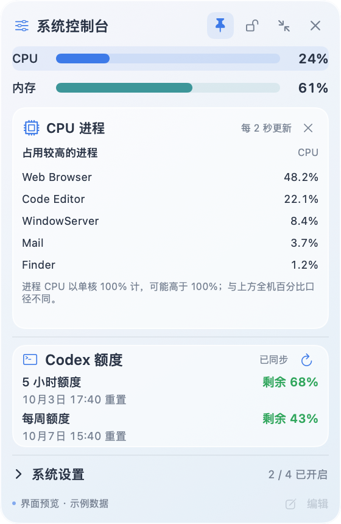
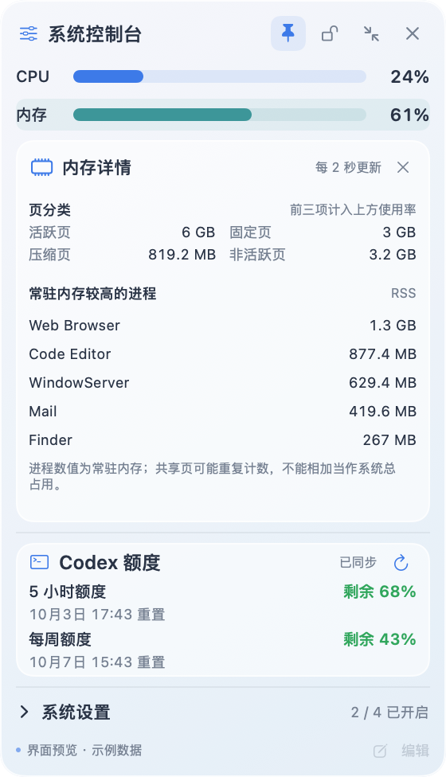

# Mac 浮窗控制台 · Mac Float Console

**常驻菜单栏的小型 macOS 浮窗，一眼查看系统状态和 Codex 额度。**

简体中文 · [English](README.md)

应用在菜单栏提供入口，打开后显示可拖动、可置顶的浮窗。CPU 与内存使用率来自这台 Mac；Codex 区域显示当前登录账户的 5 小时和周限额剩余百分比。系统开关区可以折叠，整个浮窗也可以缩略，尽量少占桌面空间。

产品界面预览使用示例数值；实际运行时读取实时系统指标和已登录账户的额度。

## 当前功能

| 区域 | 行为 | 刷新频率 |
| --- | --- | --- |
| CPU | 汇总全机各逻辑处理器的忙碌时间；点击查看 CPU 较高的进程 | 每 2 秒 |
| 内存 | 活跃、固定和物理压缩内存占安装内存的比例；点击查看页分类和常驻内存较高的进程 | 每 2 秒 |
| Codex | 显示 5 小时与周限额的剩余百分比及本机时区的重置时间 | 启动时、每 5 分钟或手动刷新 |
| 浮窗 | 拖动、置顶、锁定、折叠开关、缩略与展开；关闭后从菜单栏重开 | 即时 |
| 系统开关 | 防止休眠、勿扰模式、显示隐藏文件、自动隐藏 Dock | **目前仅演示界面状态** |

缩略状态保持 180 点宽，保留两项 Codex 剩余百分比，不显示重置时间，整体不透明度为 75%：

默认面板为 280 × 242 点；展开系统开关后为 280 × 366 点；缩略状态为 180 × 106 点。点击任一指标条会展开按需详情，再点同一条或详情右上角的关闭按钮即可收起；缩略模式点击指标也会直接打开详情。

## 本地运行

需要 macOS 14 或更新版本，以及包含 Swift 的 Xcode Command Line Tools。在 Mac 上从源码构建：

~~~sh
zsh scripts/build-app.sh
open dist/系统控制台.app
~~~

构建脚本会在被忽略的 dist 目录生成本地签名的应用和压缩包。仓库不提供预编译或公证后的发行版。CPU、内存无需登录；显示真实 Codex 额度需要安装 Codex CLI，并使用 ChatGPT 账户登录。

正常模式拖动顶部标题区域；缩略模式按住 Codex 数据区域拖动，CPU 和内存条保留点击操作。右侧蓝色按钮可展开。图钉控制置顶，锁形按钮在两种模式下阻止拖动。关闭浮窗后，可通过菜单栏图标重新打开或退出应用。

## 数据与隐私

CPU 由相邻两次处理器时间计数计算，因此启动后约 2 秒才显示第一个百分比。内存由 macOS 虚拟内存计数计算，口径接近但不一定完全等于「活动监视器」的“已使用内存”。百分比取整后，即使采样持续更新，负载稳定时也可能连续显示同一个数。

进程详情通过本机 `ps` 读取，只有展开详情时才采样。CPU 进程百分比以单核 100% 计，可高于 100%，不能与上方全机 0–100% 指标直接比较。内存进程数值是常驻内存（RSS），共享页可能被多个进程重复计入，不能相加当作系统已用内存。内存页分类中的非活跃页不计入上方使用率。进程列表不上传，也不保存。

Codex 额度通过本机 Codex CLI 的 app-server 只读请求获取。应用不直接读取或保存登录凭据、不发起模型任务，也不使用额度重置次数。CLI 不可用或未登录时会显示不可用状态；刷新失败时保留上次成功读数。目前没有接入分析、遥测或应用级偏好存储。

四个彩色开关只改变屏幕上的状态，不修改 macOS 设置；退出应用后会复位。“编辑快捷功能”入口暂不可用。

## 产品文档与开发

- [产品需求文档 / PRD（简体中文）](docs/PRD.zh-CN.md)
- [Product requirements / PRD (English)](docs/PRD.en.md)
- [English README](README.md)

~~~sh
zsh scripts/check-system-metrics.sh
zsh scripts/check-quota.sh
zsh scripts/export-previews.sh --demo
~~~

预览脚本从同一份 SwiftUI 界面导出图片，使用合成的 CPU、内存和 Codex 数值，输出到被忽略的 artifacts 目录。上方提交到仓库的图片也都是示例数据，不含个人账户截图。

下一阶段计划在明确权限、状态同步和本地保存方式后，实现真正的系统开关；随后再做快捷功能编辑与分发打包。
